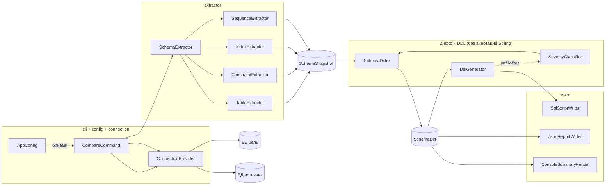
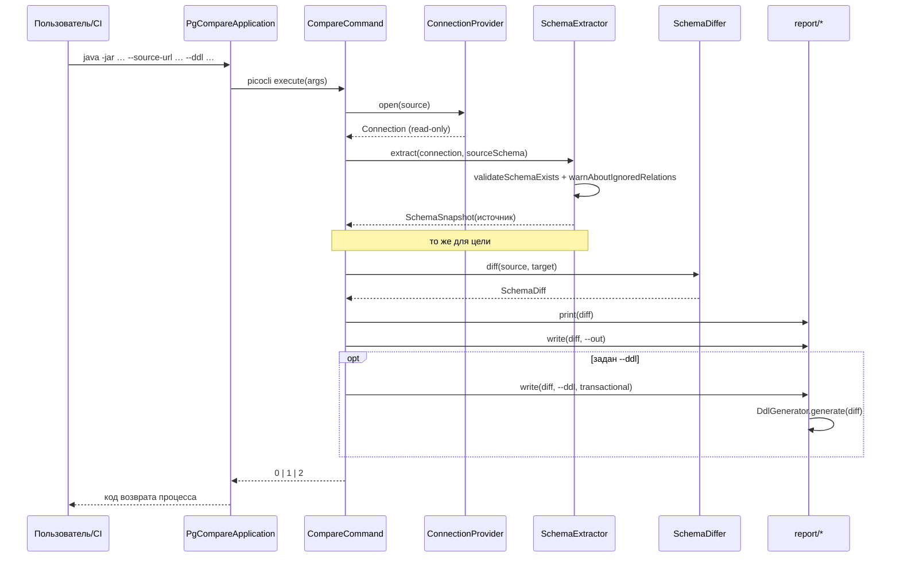
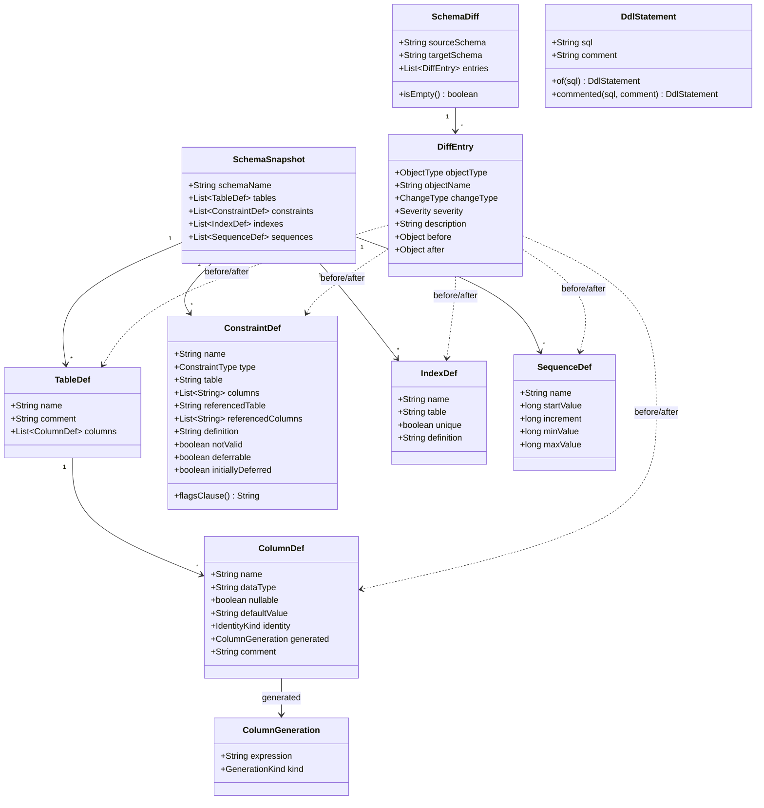

# Архитектура pg-compare

Для кого: разработчик, который собирается читать, менять или расширять код.
Внешне наблюдаемое поведение описано в [`SPECIFICATION.md`](SPECIFICATION.md), правила в форме
требований — в [`REQUIREMENTS.md`](REQUIREMENTS.md).

---

## 1. Общая схема

Утилита — конвейер из четырёх стадий с чистым (без I/O) ядром в середине:



Три выхода (`console`, `JSON`, `SQL`) — потребители одного и того же `SchemaDiff`; они ничего друг
о друге не знают и не могут разойтись по составу различий.

---

## 2. Поток данных одного запуска



Подключение закрывается в `try`-with-resources сразу после вычитывания стороны: к моменту
сравнения и записи активных соединений к базе уже нет.

---

## 3. Пакеты

| Пакет | Назначение | Ключевые типы | Зависимости |
|---|---|---|---|
| `com.anri.pgcompare` | точка входа, перенос кода возврата в процесс | `PgCompareApplication` | `cli` |
| `cli` | разбор опций и оркестрация сценария | `CompareCommand` | `connection`, `extractor`, `diff`, `report`, `model`, `exception` |
| `config` | превращение чистого ядра в бины Spring | `AppConfig` | `ddl`, `diff` |
| `connection` | одноразовые read-only JDBC-подключения | `ConnectionProvider` | `exception` |
| `extractor` | `pg_catalog` → модель, нормализация определений | `SchemaExtractor`, `TableExtractor`, `ConstraintExtractor`, `IndexExtractor`, `SequenceExtractor`, `DefinitionNormalizer` | `model`, `exception` |
| `model` | неизменяемые определения объектов схемы | `SchemaSnapshot`, `TableDef`, `ColumnDef`, `IdentityKind`, `ColumnGeneration`, `GenerationKind`, `ConstraintDef`, `ConstraintType`, `IndexDef`, `SequenceDef` | — |
| `diff` | сравнение снимков, классификация | `SchemaDiffer`, `SeverityClassifier`, `SchemaDiff`, `DiffEntry`, `ObjectType`, `ChangeType`, `Severity` | `model` |
| `ddl` | `SchemaDiff` → упорядоченные операторы | `DdlGenerator`, `DdlStatement` | `diff`, `model`, `exception` |
| `report` | оформление выходов | `ConsoleSummaryPrinter`, `JsonReportWriter`, `SqlScriptWriter` | `diff`, `ddl`, `exception` |
| `exception` | единый тип ошибки прикладного уровня | `CompareException` | — |

Зависимости направлены «внутрь»: `model` не знает ни о ком, `diff` и `ddl` — только о `model` и
о себе, про Spring ничего не знают. Наружу (в `report`, `extractor`, `cli`) знание о Spring есть,
но ограничено аннотациями компонентов Spring и `JdbcTemplate`.

---

## 4. Модель данных



Соглашения модели:

- всё — `record`'ы; списки приходят из `List.copyOf` / `toList`, то есть фактически неизменяемы;
- дочерние объекты (`ConstraintDef`, `IndexDef`) хранят имя таблицы **полем**, а не вложенностью:
  сравнение работает плоскими картами «таблица.имя»;
- `DiffEntry.before/after` типизированы как `Object` — сознательно: в отчёт кладётся полное
  определение владельца, а Jackson сериализует конкретный record без полиморфных маркеров;
- `ConstraintDef.flagsClause()` — единственное «поведение» в модели: тот же текст используется
  для сравнения флагов и для генерации SQL, поэтому расхождение между ними невозможно.

---

## 5. Ключевые решения

### 5.1 Snapshot-подход вместо потокового сравнения

Обе схемы целиком вычитываются в память, после чего сравнение — чистая функция
`(Snapshot, Snapshot) → SchemaDiff`.

- **Плюсы:** ядро тестируется без базы; не нужно держать два соединения открытыми во время
  сравнения; результат детерминирован; легко добавить новый выход, не трогая чтение.
- **Минусы:** память пропорциональна размеру схемы; между двумя `extract` состояния баз могут
  разойтись (длинная миграция в процессе сравнения не поймана). Для CLI, сравнивающего схемы
  порядка тысяч объектов, оба минуса незначимы.

### 5.2 `pg_catalog` вместо `DatabaseMetaData`

JDBC-метаданные не дают ни канонических определений (`pg_get_constraintdef`/`pg_get_indexdef`), ни
identity/generated-атрибутов, ни комментариев, ни различения «индекс обслуживает констрейнт».
Ценой решения является привязка к PostgreSQL и к его каталогу (см. §8).

### 5.3 Определение как текст + структурные флаги

Сравнение по тексту из `pg_get_constraintdef` покрывает состав колонок, опорную таблицу и
referential actions одним сравнением. Но этот текст не содержит `DEFERRABLE`, `INITIALLY DEFERRED`
и `NOT VALID`, поэтому они вынесены в отдельные булевы поля и сравниваются через
`flagsClause()`. Аналогично `MATCH`/`ON DELETE`/`ON UPDATE` пересобираются не из полей, а
переносятся «хвостом» из текста (`foreignKeyTail`) — иначе пришлось бы парсерить вывод сервера.

### 5.4 Нормализация префикса собственной схемы

`DefinitionNormalizer` (package-private) срезает имя сравниваемой схемы из определений на этапе
чтения. Благодаря этому:

- сравнение схем с разными именами (`app_v1` → `app_v2`, `src` → `tgt`) не даёт фантомов;
- `DdlGenerator` всегда работает с «неквалифицированным относительно своей схемы» текстом и
  сам решает, где вернуть квалификацию (`qualify`, `qualifyDefault`, `qualifyIndexTable`).

Обмен сложностью: вместо «помнить о схеме в каждом правиле сравнения» — одно место срезки и одно
место обратной вставки.

### 5.5 Чистое ядро, собранное в `config`

`SchemaDiffer`, `SeverityClassifier`, `DdlGenerator` не несут аннотаций Spring и собираются
`AppConfig`'ом как обычные бины. Unit-тесты (`new SchemaDiffer(new SeverityClassifier())`,
`new DdlGenerator()`) создают их напрямую, без контекста, — и потому быстры.

### 5.6 `DdlStatement` — данные, а не строка

Оператор переносится вместе с опциональным пояснением (`of` / `commented`). Это позволяет
сервисным комментариям (`BREAKING: …`, `review: …`) участвовать в формате файла, не попадая в
текст SQL, и проверять их отдельно от оператора.

### 5.7 Порядок секций вместо анализа графа зависимостей

Вместе с каскадными правилами (пропуск дочерних объектов снимаемой таблицы/колонки) фиксированный
порядок покрывает зависимости констрейнтов схем PostgreSQL. Это компромисс: он не решает
произвольный граф (например, зависимость представления от констрейнта), зато предсказуем и проверяем
round-trip тестом.

### 5.8 Регистронезависимое сопоставление

`byName` приводит ключ к нижнему регистру. Это воспроизводит свёртку имён сервером, а не борется с
ней: экранированные `Users` и `users` в одной схеме — редкость, и для них сохраняется последний
объект (описание — в javadoc `byName`).

### 5.9 Локализация: код и консоль по-русски, артефакты по-английски

Тексты, попадающие в файлы-артефакты (`description`, служебные комментарии `.sql`, сами
операторы), не локализованы: отчёты сравнивают между прогонами и скармливают инструментам.
Русскими сделаны javadoc, комментарии, консольная сводка, `--help`, сообщения исключений и логов.

---

## 6. Обработка ошибок

Единый прикладной тип — `CompareException` (unchecked). Он поднимается из `connection`,
`extractor`, `ddl`, `report` и перехватывается в единственной точке — `CompareCommand.call()`, где
превращается в `stderr`-строку и код 2. Промежуточные слои не «глотают» и не оборачивают повторно:
`CompareCommand.extract` пробрасывает `CompareException` как есть, чтобы не терять исходное
сообщение. Так одно место решает, как ошибка выглядит для пользователя.

---

## 7. Производительность и ресурсы

- Один запрос на вид объектов (`TABLES_SQL`, `COLUMNS_SQL`, плюс по одному у констрейнтов,
  индексов, sequence), группировка в памяти (`LinkedHashMap`) — без N+1 на таблицы и колонки.
- Сложность сравнения — линейная по числу объектов после построения карт (O(n)); сортировка
  сделана сервером через `ORDER BY`, поэтому порядок стабилен без дополнительной работы.
- Память: два снимка схемы одновременно.
- Соединений — максимум два, последовательно; read-only; закрываются до сравнения.
- Пул соединений отсутствует сознательно: процесс живёт секунды.

---

## 8. Совместимость

| Слой | Требование | Откуда |
|---|---|---|
| JDK | Java 25 | `pom.xml` `java.version` |
| PostgreSQL | минимально 12 (нужны `attgenerated` и `pg_constraint.conindid`); identity — с 10 | используемые поля каталога |
| Проверено на | PostgreSQL 17 | образ `postgres:17` в `SchemaRoundTripIT` |
| Сервер | `GENERATED … VIRTUAL` появляется в 18; в `GenerationKind` он уже поддержан на чтение/вывод | javadoc `GenerationKind` |
| Драйвер | `org.postgresql` (версия из Spring Boot BOM) | runtime-зависимость |

Версии сборки: Spring Boot parent `4.0.0`, `picocli-spring-boot-starter` `4.7.7`,
Testcontainers BOM `1.21.3`, Lombok (optional, только аннотационная обработка). Jackson — из
`spring-boot-starter-json`, пакет `tools.jackson.databind` (линейка Jackson 3).

---

## 9. Тестовая архитектура

```
mvn test     → surefire, только unit-тесты (65 штук, без базы и Docker)
mvn verify   → + failsafe: SchemaRoundTripIT (нужен Docker или внешняя база)
```

| Слой | Чем проверяется | Что является oracle |
|---|---|---|
| `diff` | `SchemaDifferTest` (18), `SeverityClassifierTest` (4) | состав, направление, severity, тексты `description` |
| `ddl` | `DdlGeneratorTest` (39) | дословный текст оператора, порядок, наличие/отсутствие служебного комментария |
| `report` | `SqlScriptWriterTest` (4) | текст `.sql` целиком: обёртка, порядок относительно `BEGIN`/`COMMIT` |
| полный цикл | `SchemaRoundTripIT` (3) | **реальный PostgreSQL**: миграция применена → повторный дифф пуст; повторный прогон не даёт операторов; ошибки на несуществующую схему |

Round-trip — главная страховка: оператор, молча потерянный, искажённый или вставший не в том
порядке, оставляет остаточные различия, и IT падает. Поэтому фикстуры IT намеренно нагружают все
ветки генерации (смена типа, снятие колонки с её индексом и CHECK, пересборка PK и UNIQUE с
флагами, identity, generated, межсхемные ссылки, `nextval`, NOT VALID FK, новая таблица).

Известное ограничение окружения: на машинах, где testcontainers не может договориться с Docker
Desktop (npipe отвечает `HTTP 400`), IT не запускается; предусмотрен переход на внешнюю базу через
`PGCOMPARE_IT_URL` / `PGCOMPARE_IT_USER` / `PGCOMPARE_IT_PASSWORD`, иначе тесты пропускаются по
предположению (assumption).

---

## 10. Как расширять

### 10.1 Добавить новый тип объекта (пример: представления)

1. `model/` — record определения.
2. `extractor/` — новый экстрактор: `ORDER BY` для стабильности, срезка префикса собственной схемы
   через `DefinitionNormalizer`, если сервер рендерит текст с именем схемы.
3. `SchemaSnapshot` — новый компонент списка; компилятор найдёт все места создания снимка.
4. `SchemaExtractor` — вызов экстрактора; если объект был в «непокрытых» (`IGNORED_RELATIONS_SQL`,
   `IGNORED_RELATION_LABELS`) — удалить его оттуда, иначе предупреждение соврёт.
5. `diff/ObjectType` — константа; `SchemaDiffer` — метод `diffXxx` и ключ сопоставления.
6. `SeverityClassifier` — правило (по умолчанию новое удаление = `BREAKING`).
7. `ddl/DdlGenerator` — секция и её место в порядке зависимостей.
8. Тесты: unit на дифф и генератор + расширение фикстур `SchemaRoundTripIT`, чтобы round-trip
   доказал применимость на живой базе.

### 10.2 Поддержать ранее неподдерживаемый `contype`

Добавить ветку в `ConstraintExtractor.mapType` → константу в `ConstraintType` → ветку в
`DdlGenerator.inlineDefinition` (без канонического определения `requireDefinition` бросит ошибку —
это ожидаемое поведение) → тесты. Пока ветки нет, объект пропускается с `log.warn`, а не ломает
прогон.

### 10.3 Добавить опцию CLI

Поле с `@Option` в `CompareCommand` + проброс в нужный компонент. Держите значения по умолчанию
совместимыми: `--transaction` уже сделан negatable, новые флаги стоит держать так же, чтобы дефолт не
менял поведение существующих вызовов.

### 10.4 Чего избегать

- Локализовать тексты артефактов — сломает сравнения отчётов и тесты (см. `docs/README.md`).
- Менять порядок секций в `DdlGenerator` без перепроверки round-trip.
- Переносить аннотации Spring внутрь `diff`/`ddl` — ядро теряет тестируемость без контекста.
- Читать схему через `DatabaseMetaData` «для быстроты»: атрибутов, на которых держится дифф, там нет.
